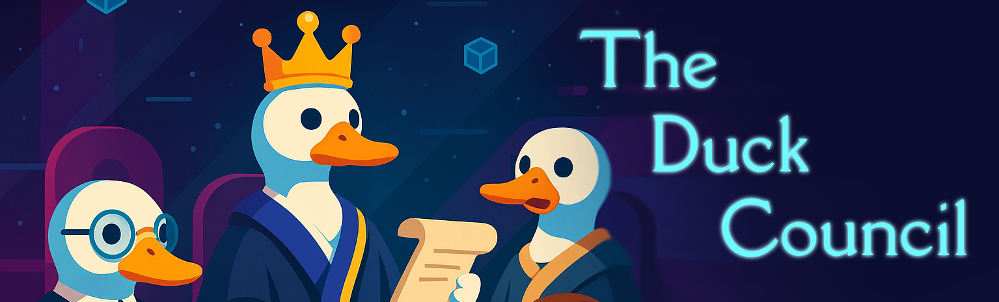

AI-Powered Reflections for Human Decisions
Ask the council. Reflect with ducks. Make better choices.

## What is Duck Council?

Duck Council is a quirky, AI-driven decision evaluator where you describe a real-life situation and your intended action—and a council of AI duck agents evaluates how suitable that action is.

#### Each duck provides:

- A suitability score (0–100)
- A personal reflection based on its own reasoning style
- A perspective like logic, ethics, emotion, or risk-taking

## But Why?

Humans are emotional. Decisions are messy.
But what if you had a council of intelligent ducks to reflect back your choices?

## Inspired by:

- [Rubber duck debugging](https://rubberduckdebugging.com)
- Inner committee therapy
- Thought experiments & moral dilemmas

This project combines LLMs + agent collaboration to simulate multi-perspective reasoning.

🔧 Tech Stack

| Layer | Tools |
|-----|-----|
|Backend|CrewAI, FastAPI|
|LLM|OpenAI or other compatible providers|
|Frontend |React / Tailwind |

## 🦆 The Ducks (Starter Pack)

|Duck Name|	Role|	Style of Reasoning|
|-----|-----|----|
|Pragmatic Duck|	Focuses on logical feasibility|	“This makes sense. It's efficient.”|
|Emo Duck|	Rebelious. Prioritizes feelings & empathy|	“How would this make people feel?”|
|Ethical Duck|	Cautious. Values morality & fairness|	“Is this the right thing to do?”|
|Risky Duck|	Adventurous and loves bold choices and chances|	“Fortune favors the brave!”|
|Winner Duck|	Treats everything as a competition|	“How can I get the best possible outcome”|

## 🚀 How It Works

1. You submit a scenario
2. Situation: “I have a final exam tomorrow.”
3. Intended action: “I'm going to binge-watch Netflix.”

Each duck reflects

- Pragmatic Duck: “Not practical. 20/100.”
- Emo Duck: “You probably need the break, but...”
- Risky Duck: “YOLO? 65/100.”
- Ethical Duck: “You owe it to your future self.”

You get a council verdict
→ A mix of scores, reflections, and wisdom from your feathered advisors.

## 🛠️ Setup

Copy `.env.example` to `.env` and populate the variables

You need to install crew.ai CLI to your environment

```bash
cd ./duck_council/src/duck_council/

# install crew.ai dependencies
crewai install
```

Then install dependencies for Flask

```bash
# Install dependencies
uv pip install -r requirements.txt

# Run API
uvicorn app.main:app --reload
```

## 🧪 How To Add More Ducks?

1. Add agent description in `.\src\duck_council\config\agents.yaml`
2. Add agent's task description in `.\src\duck_council\config\tasks.yaml`
3. Initialize the *task* (with @task decorator) and the *agent*  (with @agent decorator) inside `.\src\duck_council\crew.py`
4. Inside the same `crew.py` file, update this function body `get_task_map`
5. Inside `constants.py`, add the name of your agent here
  ```py
    class Constants:
      ...
      class agent_names:
        WINNER = 'winner'
        PRAGMATIC = 'pragmatic'
        ETHICAL = 'ethical'
        EMO = 'emo'
        RISKY = 'risky'
  ```
6. Inside `config.py` edit the `ALLOWED_AGENT_LIST` array
