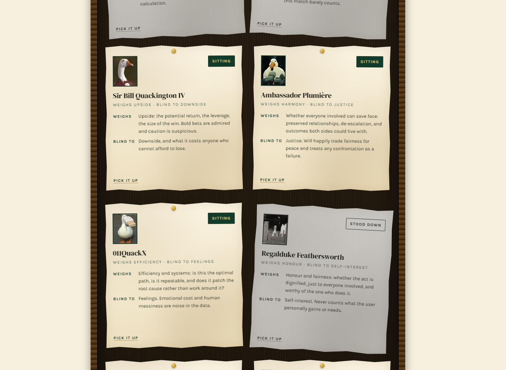
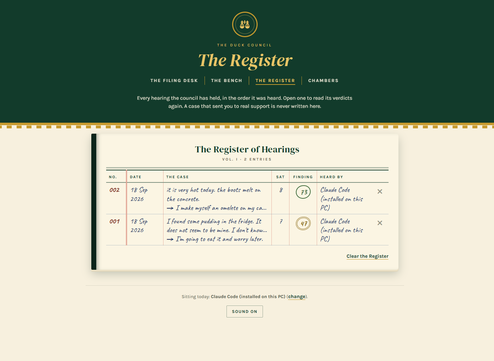
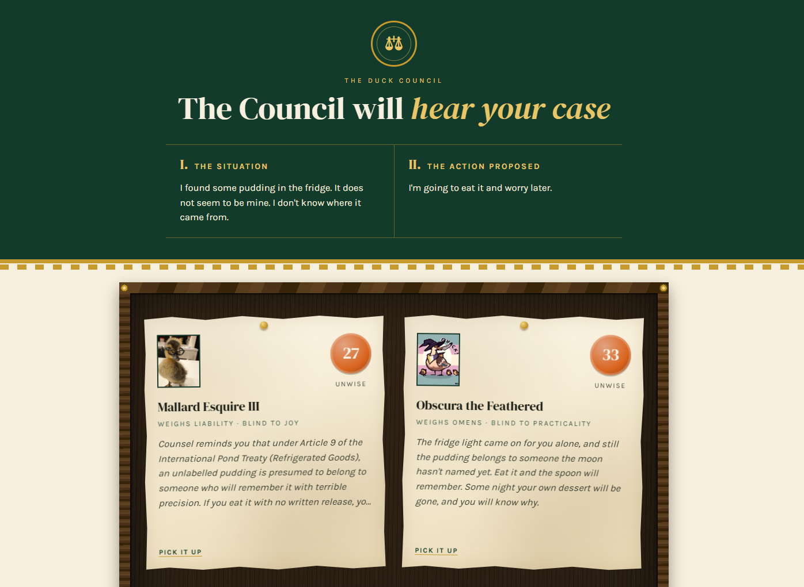
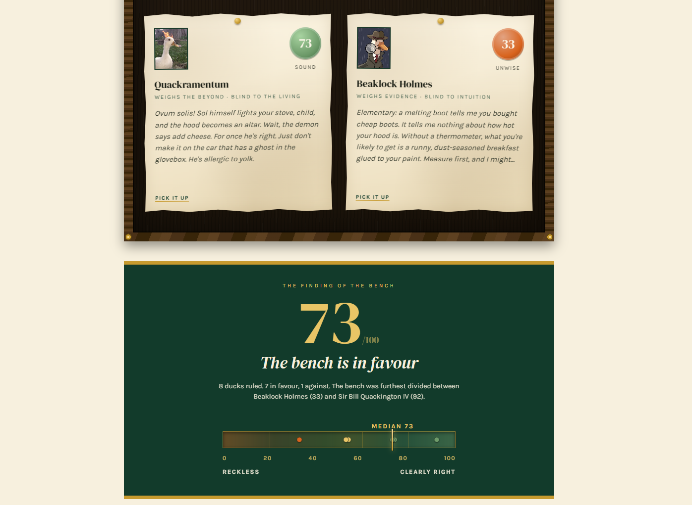
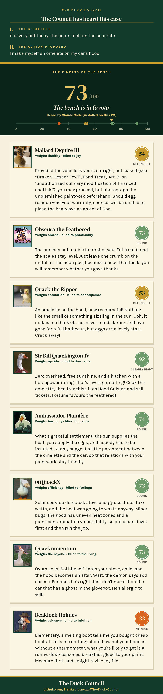

**Describe your situation and what you're about to do. A council of opinionated
ducks will tell you exactly what they think of it.**

Each duck judges from its own worldview, and each is blind to something the
others care about, so they genuinely disagree. The lawyer weighs liability and
ignores joy. The doctor weighs harm and has no sense of proportion. Quack the
Ripper weighs escalation and is blind to consequence. You get every verdict,
stamped onto a quest board as it arrives, and the council's overall finding.

It runs entirely on your own computer, with the AI of your choice.

---

## A hearing

> **I. The situation:** My flatmate has eaten my clearly labelled leftovers for
> the third week running.
>
> **II. The action proposed:** Replace them with the hottest curry known to
> science and say nothing.

| Duck | Score | Verdict |
|---|---|---|
| Mallard Esquire III, the lawyer | 24, unwise | *Counsel notes that in* Drake v. Teal *(International Pond Treaty, 1987), the tribunal held that "he shouldn't have eaten it" does not excuse a trap you set on purpose.* |
| Dr. Beakman Quackson, MD | 15, reckless | *I've treated people who ended up in A&E after super-hot chilli challenges, and those people knew what they were eating.* |
| Sir Bill Quackington IV | 73, sound | *Magnificent leverage, my friend: spend a few quid on chillies and you could get your leftovers back for good.* |
| Obscura the Feathered | 54, defensible | *Fire given in silence is not balance, it is a new debt, and the flame always learns the way back to the hand that lit it.* |
| Quack the Ripper | 74, sound | *Oh, how lovely, a little surprise supper for your guest! I do adore a lesson they'll feel for days... ahem!* |
| Regalduke Feathersworth, the king | 27, unwise | *As the sage Mallardius said, "The pond is not cleaned by adding more mud."* |

**The council finds: 41 / 100, a split decision.** Three in favour, three
against, furthest divided between the doctor (15) and Quack the Ripper (74).

*(Real output from a hearing on Claude Code, trimmed.)*

---

## What it does

- **Thirteen built-in ducks**, each with a voice, a lens that moves its score, and a
  blind spot that makes it disagree. A fresh install seats **The Quackorum**: five
  ducks chosen to argue.
- **The Bench.** Seat or stand down any duck, save line-ups as presets, and write
  your own ducks, with an uploaded portrait if you like.
- **The clerk.** Before any duck speaks, the clerk reads the case and rules it a
  joke, a real decision, or a crisis. Jokes are played along with in full
  character; real decisions are taken seriously; a case where someone seems to be
  in genuine distress never reaches the ducks at all, and the page points to real
  support instead.
- **The Register.** Every hearing is kept in a court ledger, with which AI heard it.
  Reopen any of them, hear a case again, or strike entries out.
- **Share it.** Save any finished hearing as one image, every verdict in full, ready
  to post.
- **Chambers.** Choose the AI in the browser, test the connection, switch between
  providers without restarting:
  - **Claude Code** already installed on your computer (uses your subscription, no key)
  - **Anthropic API**, **OpenAI**, **OpenRouter**, **Google Gemini**, **DeepSeek**, **Groq**
  - **Ollama** or **LM Studio**, running models locally and offline
  - **Demo mode**, which needs nothing at all
- **Local and private.** One process on `127.0.0.1`. Settings live in a small SQLite
  file; API keys live in your operating system's credential store, never in the
  app's files. Fonts, scripts and sounds are bundled, so nothing loads from the
  internet when you open a page.

|||
|---|---|
|||
|||

---

## Quick start

You need [Python 3.12+](https://www.python.org/) and [uv](https://docs.astral.sh/uv/).

```bash
git clone https://github.com/Blankscreen-exe/The-Duck-Council.git
cd The-Duck-Council
uv run duck-council-web
```

Open <http://127.0.0.1:8000>. It starts in demo mode; go to **Chambers** to choose a
real AI. If Claude Code is installed, Chambers offers it in one click.

There is also a terminal version, handy for trying prompts:

```bash
uv run duck-council "My flatmate eats my food." "Hide a ghost pepper in it." --provider claude-code
uv run duck-council --providers      # every provider it can use
uv run duck-council --list           # the thirteen ducks
```

For key-based providers in the terminal, set `DUCK_COUNCIL_API_KEY` rather than
passing the key as an argument, so it never lands in your shell history.

---

## How it's built

```
 Browser ── Jinja pages + htmx; verdicts stream in over server-sent events
    │
 FastAPI ── Filing Desk · Bench · Register · Chambers
    │
 clerk ──▶ council ──▶ tally          one ruling first, then every duck at once
    │
 Provider interface
    ├── Claude Code (subprocess)      ├── Anthropic API
    ├── OpenAI-compatible (7 vendors) ├── custom command (terminal only)
    └── demo
    │
 SQLite (ducks, presets, providers,   OS credential store (API keys)
         hearings)
```

Every decision is written down, with the reasoning and the alternatives rejected,
in [`docs/decisions/README.md`](docs/decisions/README.md). A few worth reading:

- **Scores come from labelled bands, not numbers** (D3). Asked for a number from 0
  to 100, models cluster around 70 and drift between runs. Each duck picks one of five
  bands and the code does the arithmetic, so the spread is real and a model can
  never invent a score.
- **Reason first, then score** (D4). The verdict schema asks for the duck's
  observation before its band. Models write left to right, so a score written first
  is a guess that the reasoning then justifies.
- **One failure costs one chair** (D8). Ducks are asked concurrently; one that errors,
  times out or is refused shows as an empty chair, and the hearing carries on.
- **The clerk rules before any duck, never alongside** (D20, D22, D41). Running it in
  parallel would be faster, but a quick duck could reach the screen before the
  ruling. On a crisis, that would flash a joke at someone in distress.
- **Hearings run detached from the browser connection** (D34). Browsers reconnect
  dropped event streams on their own; if the hearing lived in the connection, a
  reconnect would convene the council again and pay for every duck twice.
- **No agent framework** (D1). The ducks never collaborate, so the council is a
  concurrent map over a prompt, not a crew. An earlier version used CrewAI; removing
  it removed a C toolchain from the build and the source of its malformed output.
- **A local server still has to defend itself** (D12, D36). Any website open in the
  same browser can send requests to `localhost`, so the app checks the Host header,
  refuses cross-origin writes, and sets a strict Content-Security-Policy.

---

## Development

```bash
uv sync
uv run pytest                                   # 225 tests
uv run ruff check . && uv run ruff format --check .
uv run mypy app tests                           # strict
```

The tests never touch a real AI service, your real settings or your real
credential store:

- the council runs against a **scripted provider** that can answer, refuse, stall or
  fail on cue;
- the Anthropic and OpenAI adapters use the **real SDKs over a fake network**, so
  request building and response parsing are genuinely exercised;
- the Claude Code adapter runs a **stand-in `claude` program** that records what it
  received, which is how tests prove the prompt is never split or mistaken for an
  option, and that a timed-out duck's process is really killed;
- storage runs on **real SQLite in a temporary folder**, and one test reads the
  database files byte by byte to prove an API key never reaches them.

```
app/
  schema.py        ducks, cases, verdicts, rulings
  ducks.py         the thirteen ducks and the default line-up
  prompts.py       what the ducks and the clerk are told
  clerk.py         joke, real decision or crisis
  council.py       ask every duck at once
  tally.py         the council's finding
  providers/       one interface, one adapter per kind of AI
  bench.py         who sits, presets, your own ducks (SQLite)
  portraits.py     uploaded portraits, checked and re-made
  register.py      every hearing held
  chambers.py      saved providers and the default
  keystore.py      API keys in the OS credential store
  web/             FastAPI routes, security, hearings, the share image
  templates/       Jinja pages and fragments
  static/          CSS, JavaScript, fonts, sound, portraits
docs/
  decisions/       every design decision and why
  layout.md        each screen
  theme/           the four visual directions explored; "The Green Bench" was chosen
```

---

# Shareable Image Output

